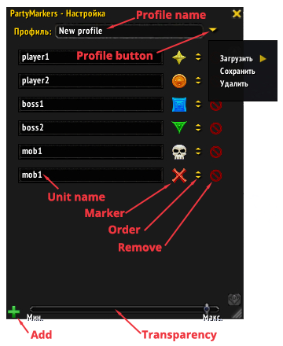
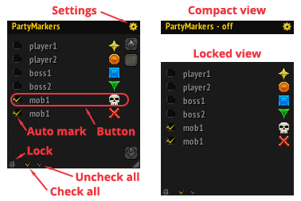

#PartyMarkers
This is a World Of Warcraft addon that helps to set markers on players and mobs in the raid.  
It can be useful for manual or auto marking. For example, you can set tanks and bosses markers by one click. Or you can auto mark a specific mob by the skull marker for fast *switch* and kill.    

#Addon interface
The addon has two modes: **workflow mode** and **setting mode**.

Firstly, in **setting mode** you should manually fill the list of units with markers.  
  
> **Profile name** - name of the profile that will be saved or removed.  
> To manage profiles use the menu from the **Profile button**.  
> You can add and remove the rows from the list by **Add** and **Remove** buttons.  
> Also you can change the rows order by the **Order** buttons.  
> Click the **Unit name** field by right mouse button to see the list of party's members. Click this field by middle mouse button to set the **Unit name** from you target.  
> Use the **Marker** button to change unit marker.
> You can change workflow and settings window transparency by the **Transparency** slider.  
> This window is movable by left mouse button.

Secondly, in **workflow mode** you can manually set/unset markers by the **Button** click.  
  
> Use the **Settings** button to switch between modes.  
> Check the **Auto mark** checkbox for the auto marking.  
> Use the **Check all** and **Uncheck all** buttons to quick auto marking enable/disable.  
> You can click the header to change between compact and normal view. **In the compact view auto marking is disabled**.  
> Use the **Lock** button to switch between locked and normal view.  
> Unit name can has a several colors. White - unit state is unknown. Grey - unit not found. Green - unit found and can be marked. Red - unit found and can't be marked. Color checked every 5 seconds.  
> This window is movable by *Shift* + left mouse button on the header.

#Marking
1. To mark the unit it is must be found first. And it is a great problem cause Blizzard API restrictions.  
It's easy to find the raid/party member or boss, but if you want to find other unit by the API - it's just doesn't work.  
So there is a problem with auto marking.
2. Unit can be marked if it is a raid/party member or boss. Or it's a target of the player or any raid/party member. Or it under your mouse cursor. Last two cases works fine with *grey* units.  
In all other cases unit can't be found and marking doesn't work.
3. Auto marking check performs every 1 second and every time when unit under your mouse cursor is changed.
4. You can set multiple marks for the one unit name - just add the row with same unit name in the **setting mode**. Markers will be set circular. It is useful when you want mark several units with same name.

#Have a question?
Write - **demonist616@gmail.com**

*P.S.:Sorry for my bad English*