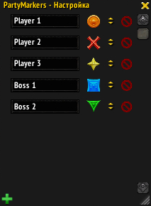
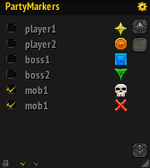

#PartyMarkers
This is a World Of Warcraft addon that helps to set markers on players and mobs in the raid.

#How does it works?!
Firstly, you should manually make a list of the players or mobs and set markers to every one.  
Secondly, you may just click a name to set the marker.

#Screenshots

#Have a question?
Write - **demonist616@gmail.com**