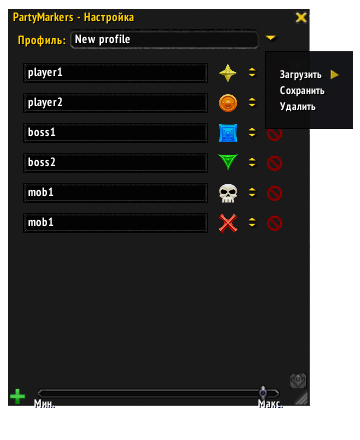

#PartyMarkers
This is a World Of Warcraft addon that helps to set markers on players and mobs in a raid.

#How does it works?!
Firstly, you should manually make a list of the players or mobs and set markers to every one.  
Secondly, you may just click a name to set the marker.

#Screenshots

#Known proglems
1. Yet this only work in raids.
2. There is some bugs with scaling and moving.
3. Yet there is not profiles.

All this bugs will be fixed soon.

#Have a question?
Write - **demonist616@gmail.com**